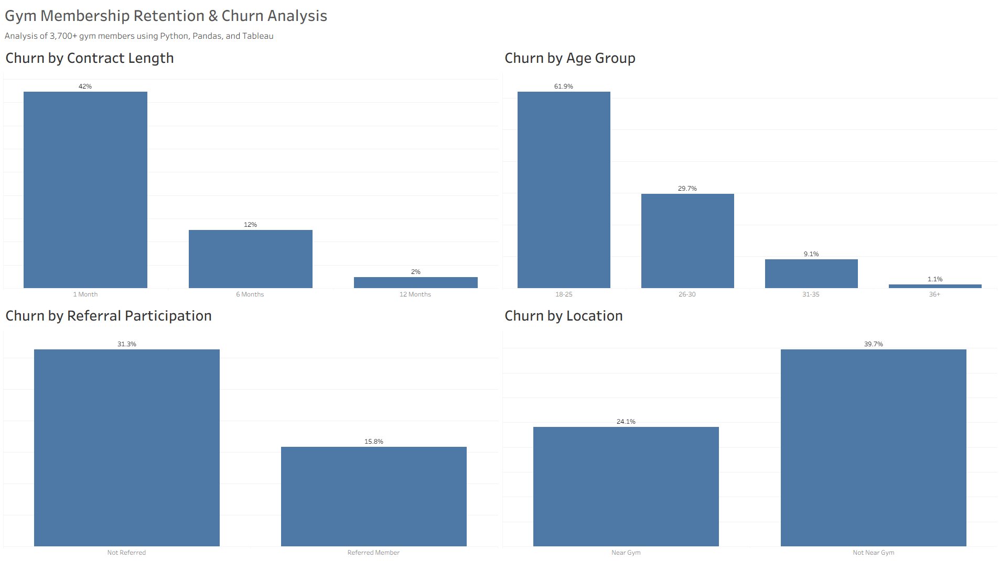

# Customer Churn Analysis Using Python & Tableau

## Overview
This project analyzes gym membership data to identify factors associated with customer retention and churn. The goal is to use Python-based data analysis and visualization to determine which member characteristics are most related to churn risk.

## Dashboard Preview

## Interactive Tableau Dashboard

View the interactive dashboard on Tableau Public:

[Tableau Dashboard](https://public.tableau.com/views/GymMembershipRetentionChurnAnalysis/CustomerRetentionChurnAnalysis?:language=en-US&:sid=&:redirect=auth&:display_count=n&:origin=viz_share_link)

## Tools Used
- Python
- Pandas
- NumPy
- Matplotlib
- Seaborn
- Jupyter Notebook

## Dataset
The dataset contains gym member information, including gender, age, location proximity, referral participation, employer partnership status, contract period, and churn status.

## Project Workflow
1. Loaded and reviewed the raw CSV dataset.
2. Cleaned and transformed the data using Pandas.
3. Created readable labels for churn and demographic fields.
4. Calculated overall churn rate and churn rates by customer segment.
5. Built visualizations to compare retention patterns.
6. Summarized key findings and future improvements.

## Key Findings
- Overall churn rate was approximately 26.5%.
- Members near the gym had lower churn than members who were not nearby.
- Younger members had higher churn rates.
- Gender showed little difference in churn behavior.

## Visualizations
Visualizations created in the notebook are saved in the `images/` folder, including:
- Retention by gender
- Retention by location proximity
- Retention by employer partnership
- Retention by referral program
- Churn by age

## Future Improvements
- Build a machine learning model to predict churn.
- Add time-based membership data to analyze seasonal churn trends.
- Compare churn across different gyms, locations, or programs.
